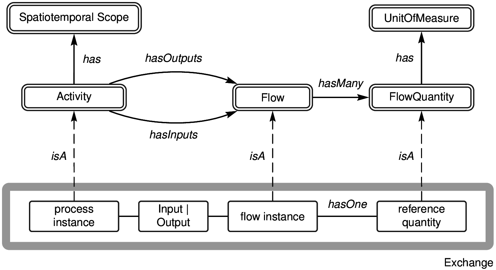

# lca-tools-datafiles
Files that describe available LCA data resources

## What is this about?

This is a repository for storing _catalogs_ of life cycle inventory (LCI) data used for preparing life cycle assessment (LCA) studies.  The catalogs are meant to describe the _semantic_ content of the databases, as well as the network structure, without describing the _quantitative_ information.  In other words, the catalogs include exchanges but not exchange values.

All the catalogs here are generated from publicly available databases using the [lcatools](http://github.com/bkuczenski/lca-tools/) python package (not yet registered anywhere!)

## What Databases are listed?

Currently, the catalog includes archives of the following data sources:

 * US LCI, via Ecospold v1 archive downloaded from [the LCA Commons](http://lcacommons.gov/nrel);
 * Ecoinvent v3.2 (four different system models), via the "activity overview" spreadsheets available on [the Ecoinvent website](http://www.ecoinvent.org/support/documents-and-files/information-on-ecoinvent-3/information-on-ecoinvent-3.html);
 * GaBi Professional database (2014), via their [web-based ILCD archive](http://www.gabi-software.com/support/gabi/gabi-database-2014-lci-documentation/professional-database-2014);
 * ELCD 3.2, via their [downloadable ILCD archive](http://eplca.jrc.ec.europa.eu/ELCD3/datasetDownload.xhtml)
 
Current plans include indexing the 2016 versions of GaBi Professional, GaBi Lean, and all 15-odd extension databases.  Others may come soon.
 

# Data Model

The data model emphasizes **minimality** and **generality**.  The unifying characteristic is the following _minimal model for LCA_, which is an attempt at synthesizing a number of published LCA data models into a common model with the fewest possible parts:



The model has three different entity types: `processes`, `flows`, and `quantities`.  An `exchange` is a hybrid entity that consists of one `process`, one `flow`, and a *direction* (`Input` | `Output`) of the flow with respect to the process.

Each entity has **three** required fields: 

 1. an **entity type**;
 2. an **identifier**;
 3. a **reference object** which is another entity

 * a `quantity` has a reference `unit` (units are outside the scope of this model)
 * a `flow` has a reference `quantity`
 * a `process` has a reference `exchange`.
 
Although Strictly speaking the reference object is supposed to be required, in practice the reference object is allowed to be `None`/ `null` / empty.
 
In addition to the mandatory fields, each entity has an unbounded collection of `tags` which can be any text-based or numeric content that describes the entity.  **No tags are required** but some are very useful and common:

 * "Name" (common to all entities)
 * "Comment" (common to all entities)
 * "SpatialScope" and "TemporalScope" (all `processes` in the catalogs have these)\
 * "CasNumber" (many `flows` have these)
 * "UnitConversion" (some `quantities` have these)
 
Entities can also have any other tag.  The tags are meant to be fodder for search.

## JSON Archives

This repository contains archives and catalogs formatted as [[JSON]].  The JSON archivs have the following structure:

```
Archive = {
  "processes" : [ <list of process entities> ],
  "flows" : [ <list of flow entities> ],
  "quantities": [ <list of quantity entities> ],
  "exchanges": [ <list of exchanges> ],
  "dataSourceReference": "a string describing where the archive comes from",
  "dataSourceType": "a string describing the python subclass that created the archive"
}
```

Meanwhile, the entities themselves are simply defined:

`quantities` look like this:
```
quantity = {
  "ReferenceUnit": unit-identifier,
  "dataSetReference": quantity-identifier,
  "entityType": "quantity",
  "tags": {
    "Name": "name text...",
	...
  }
}
```

`flows` look like this:

```
flow = {
  "ReferenceQuantity": quantity-identifier,
  "dataSetReference": flow-identifier,
  "entityType": "flow",
  "tags": {
    "Name": "name text..."
    "CasNumber": "...",
	...
  }
},
```
`processes` look like this:

```
process = {
  "ReferenceExchange": "<Direction>: <flow-identifier>",
  "dataSetReference": process-identifier
  "entityType": "process",
  "tags": {
    "Name": "name text..."
    "SpatialScope": "spatial text...",
    "TemporalScope": "temporal text...",
	....
  }
}
``` 

And `exchanges` look like this:
```
exchange = {
  "direction": "<direction>",
  "flow": flow-identifier,
  "process": process-identifier
}
```

In each case, the identifier listed in one entity's `dataSetReference` field should match the identifier listed in another entity's `ReferenceEntity` field.

`<direction>` is either `Input` or `Output`.

## Data Source Types

Within each archive, the `dataSetReference` fields should each uniquely identify an entity with respect to the `dataSourceReference` value, but interpretation varies depending on the archive type. For instance, if the `dataSourceType` is an `IlcdArchive`, then the `dataSourceReference` points to the root of the archive and the `dataSetReference` would be things like `processes/<uuid>` or `flowproperties/<uuid>`.

On the other hand, if the archive is an `EcospoldV1Archive`, then `processes` are identified by name, `flows` are identified by an internal ID integer, and `quantities` are just unit strings.

Finally, if the archive is an `EcoinventSpreadsheet`, then `processes` are UUIDs; `flows` are uniquely identified by name if they are intermediate flows, or uniquely identified by name, compartment, and subcompartment if they are elementary flows; and `quantities` are-- again-- just unit strings.

